# Unihub: Nền tảng Luyện viết IELTS thông minh

Dự án Unihub được xây dựng với mục tiêu trở thành một trợ lý AI toàn diện, giúp người dùng cải thiện kỹ năng viết IELTS một cách có hệ thống và hiệu quả. Nền tảng tập trung vào việc cung cấp các bài luyện tập cá nhân hóa, chấm điểm chi tiết bằng AI và các công cụ học tập thông minh để tối ưu hóa quá trình ôn luyện.

## 1. Tính năng chính (Core Features)

Unihub cung cấp một bộ công cụ mạnh mẽ để người dùng có thể thực hành từ cấp độ từ vựng, câu, đoạn văn cho đến bài luận hoàn chỉnh.

### 1.1. Sổ tay từ vựng (Vocabulary Notebook)

Người dùng có thể xây dựng sổ tay từ vựng cá nhân hóa, không chỉ lưu trữ từ mới mà còn làm giàu chúng bằng các thông tin ngữ cảnh do AI cung cấp.

-   **Thêm từ mới:** Người dùng nhập một từ.
-   **Gợi ý thông minh:** Hệ thống tự động điền các thông tin:
    -   Dạng từ (Word Form)
    -   Nghĩa (Meaning)
    -   Phát âm (Pronunciation)
    -   Ví dụ (Examples)
    -   Collocations
    -   Từ đồng nghĩa/trái nghĩa (Synonyms/Antonyms)
-   **Cá nhân hóa:**
    -   **Ghi chú cá nhân:** Tự tạo câu hoặc ghi chú riêng.
    -   **Gắn thẻ chủ đề:** Phân loại từ vựng theo các chủ đề IELTS (ví dụ: "health", "education") để dễ dàng ôn tập.
-   **Học tập lặp lại ngắt quãng (Spaced Repetition):** Tích hợp dữ liệu cho thuật toán SRS để tối ưu hóa việc ghi nhớ.

### 1.2. Luyện viết câu (Sentence Practice)

Tính năng này giúp người dùng thực hành sử dụng từ vựng đã học trong ngữ cảnh cụ thể.

-   **Chế độ luyện tập:**
    -   Chọn từ trong sổ tay cá nhân.
    -   Chế độ ngẫu nhiên với các mức độ khó khác nhau.
-   **Đề bài thông minh:** AI tạo ra một câu tiếng Việt dựa trên từ vựng và độ khó đã chọn, có thể kèm theo "gợi ý" (hint) để giúp người dùng viết.
-   **Chấm điểm và phản hồi:**
    -   AI chấm điểm câu của người dùng dựa trên các tiêu chí IELTS.
    -   Cung cấp nhận xét chi tiết về lỗi sai và cách cải thiện.
    -   Đưa ra một câu mẫu chuẩn mực để người dùng tham khảo.

### 1.3. Luyện viết đoạn (Paragraph Practice)

Tập trung vào việc xây dựng các đoạn văn hoàn chỉnh theo cấu trúc của bài thi IELTS Writing.

-   **Chế độ luyện tập:**
    -   Viết về chủ đề liên quan đến từ vựng đã học.
    -   Chủ đề ngẫu nhiên từ ngân hàng đề thi.
-   **Cấu trúc bài viết:** Người dùng có thể chọn luyện tập từng phần của một bài luận:
    -   Mở bài (Introduction)
    -   Thân bài 1 (Body 1)
    -   Thân bài 2 (Body 2)
    -   Kết bài (Conclusion)
-   **Chấm điểm và phản hồi:** Tương tự như luyện viết câu, AI sẽ đưa ra nhận xét chi tiết về cấu trúc, lập luận, từ vựng và ngữ pháp của đoạn văn.

### 1.4. Luyện viết bài luận hoàn chỉnh (Full Essay Practice)

Mô phỏng trải nghiệm viết bài thi thật, giúp người dùng rèn luyện kỹ năng quản lý thời gian và xây dựng một bài luận hoàn chỉnh.

-   **Đề bài đa dạng:** Lấy từ ngân hàng câu hỏi IELTS đã được phân loại theo chủ đề.
-   **Giao diện viết bài:** Cung cấp trình soạn thảo với bộ đếm từ và cấu trúc bài luận rõ ràng.
-   **Phân tích toàn diện:**
    -   AI chấm điểm dựa trên 4 tiêu chí của IELTS.
    -   Liệt kê chi tiết các lỗi sai và phân loại theo mức độ (ngữ pháp, từ vựng, cấu trúc).
    -   Cung cấp một phiên bản cải thiện của bài viết, tái sử dụng tối đa cấu trúc và ý tưởng của người dùng.

## 2. Kiến trúc AI chấm điểm (AI Scoring Architecture)

Để đảm bảo kết quả chấm điểm khách quan và chi tiết, Unihub sử dụng một hệ thống gồm nhiều Micro-AI, mỗi AI chuyên trách một nhiệm vụ cụ thể.

| AI Service              | Model Gợi ý         | Nhiệm vụ                                                                     |
| ----------------------- | ------------------- | --------------------------------------------------------------------------- |
| **Grammar Scorer**      | `GPT-4.1-nano`      | Phát hiện và phân loại lỗi ngữ pháp (mạo từ, thì, hòa hợp S-V, dấu câu).    |
| **Lexical Scorer**      | `GPT-4.1-mini`      | Đánh giá sự đa dạng từ vựng, độ chính xác, collocations, lỗi chính tả.       |
| **Task Response**       | `GPT-4.1-mini`      | Kiểm tra bài viết có trả lời đúng và đủ yêu cầu của đề bài hay không.          |
| **Coherence & Cohesion**| `GPT-4.1-mini`      | Đánh giá tính mạch lạc, sự liên kết giữa các câu và các đoạn văn.          |
| **Feedback Generator**  | `Claude-3-haiku`    | Tổng hợp điểm số, đưa ra nhận xét, các ưu tiên cần cải thiện và bài viết mẫu. |

## 3. Trải nghiệm người dùng & Gamification (UX & Gamification)

Để tăng động lực và chống nhàm chán, Unihub tích hợp các yếu tố gamification:

-   **Hệ thống điểm thưởng:** Dùng điểm để mở khóa "gợi ý" (hint) khi làm bài.
-   **Nhiệm vụ hàng ngày (Daily Quest):** Ví dụ: "Viết 1 câu chứa 3 từ vựng mới".
-   **Chuỗi học tập (Streak):** Thưởng bonus khi học liên tiếp nhiều ngày hoặc hoàn thành một bài luận đủ 4 phần.
-   **Chế độ viết tập trung:** Giao diện tối giản, timer và nhạc nền giúp tập trung khi viết bài luận dài.
-   **So sánh Trước & Sau:** Hiển thị song song bài viết của người dùng và phiên bản cải thiện của AI.
-   **Ngân hàng câu (Sentence Bank):** Cho phép lưu lại những câu văn hay để tham khảo và tái sử dụng.

## 4. Ngăn xếp công nghệ (Tech Stack)

| Hạng mục            | Công nghệ                                                               |
| ------------------- | ----------------------------------------------------------------------- |
| **Frontend**        | Next.js, Progressive Web App (PWA)                                      |
| **Backend**         | Next.js (API Routes, Server Actions)                                    |
| **Authentication**  | AuthKit (WorkOS) – Free ≤ 1M MAU                                        |
| **CMS**             | Strapi                                                                  |
| **AI Services**     | GPT-4.1 (nano, mini), Claude-3-haiku                                    |
| **Cơ sở dữ liệu**    | MySQL 8.0, Redis (Cache & Sessions)                                     |
| **Lưu trữ**         | File Storage (S3-compatible)                                            |
| **Hạ tầng & Triển khai**| VPS (4GB RAM, 2 CPU), Dokploy, Nginx (Reverse Proxy)                  |
| **APIs ngoài**      | Free Dictionary API, Wordnik, Datamuse                                  |

## 5. Thiết kế hệ thống (System Design)

Dưới đây là các sơ đồ mô tả kiến trúc và các luồng hoạt động chính của hệ thống.

### 5.1. Kiến trúc tổng quan (Overall Architecture)

```mermaid
graph TB
    subgraph "Client Layer"
        UI[Next.js Frontend<br/>Desktop-First UI]
        PWA[Progressive Web App<br/>Offline Capabilities]
    end
    
    subgraph "Edge Layer"
        TRF[Traefik (Dokploy)<br/>SSL Termination & Routing]
    end
    
    subgraph "Application Layer"
        NEXT[Next.js API Routes<br/>Server Actions]
        STRAPI[Strapi CMS<br/>Content Management]
    end
    
    subgraph "AI Services"
        GRAMMAR[Grammar Scorer<br/>GPT-4.1-nano]
        LEXICAL[Lexical Scorer<br/>GPT-4.1-mini]
        TASK[Task Response<br/>GPT-4.1-mini]
        FEEDBACK[Feedback Generator<br/>Claude-3-haiku]
    end
    
    subgraph "External APIs"
        DICT[Dictionary API<br/>Free APIs]
        WORDNIK[Wordnik API<br/>Examples & Synonyms]
        DATAMUSE[Datamuse API<br/>Collocations]
    end
    
    subgraph "Data Layer"
        MYSQL[(MySQL 8.0<br/>Primary Database)]
        REDIS[(Redis<br/>Cache & Sessions)]
        FILES[File Storage<br/>Essays & Media]
    end
    
    subgraph "Infrastructure"
        DOKPLOY[Dokploy<br/>Deployment & Monitoring]
        VPS[VPS Server<br/>4GB RAM, 2 CPU]
    end
    
    UI --> TRF
    PWA --> TRF
    TRF --> NEXT
    TRF --> STRAPI
    
    NEXT --> GRAMMAR
    NEXT --> LEXICAL
    NEXT --> TASK
    NEXT --> FEEDBACK
    
    NEXT --> DICT
    NEXT --> WORDNIK
    NEXT --> DATAMUSE
    
    STRAPI --> MYSQL
    NEXT --> REDIS
    STRAPI --> FILES
    
    DOKPLOY --> VPS
```

### 5.2. Luồng xác thực người dùng (User Authentication Flow)

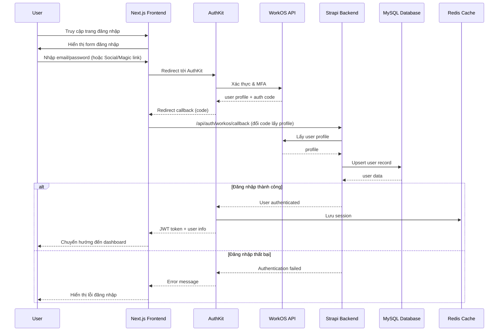

### 5.3. Luồng quản lý từ vựng (Vocabulary Management Flow)

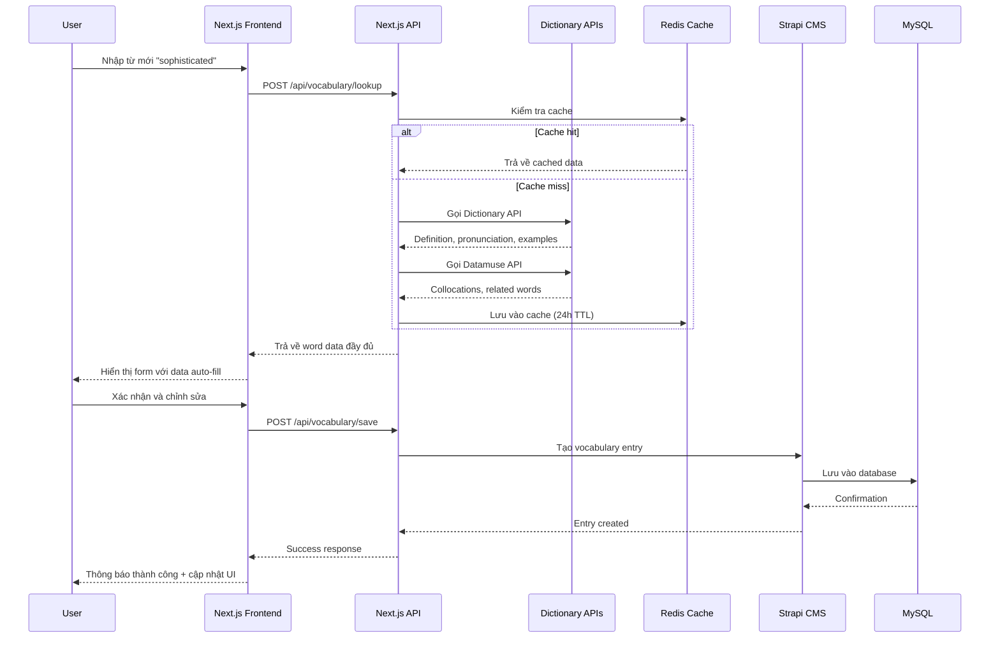

### 5.4. Luồng nộp và chấm điểm bài luận (Essay Submission & AI Scoring Flow)

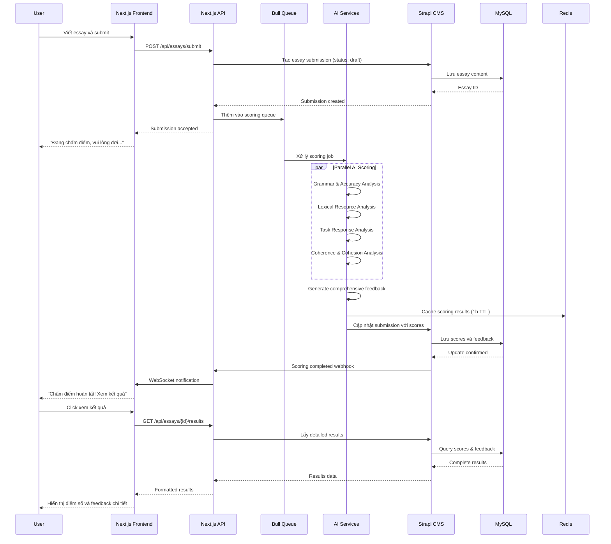

### 5.5. Luồng luyện tập (Practice Session Flow)

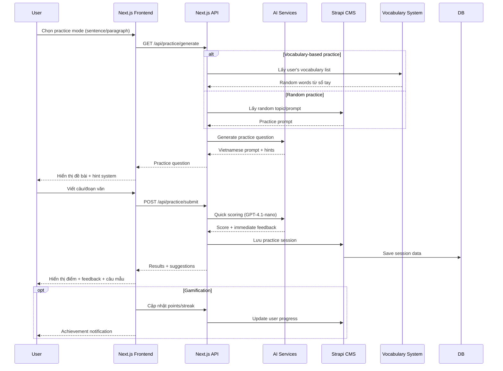

### 5.6. Luồng theo dõi tiến độ (Dashboard & Progress Tracking Flow)

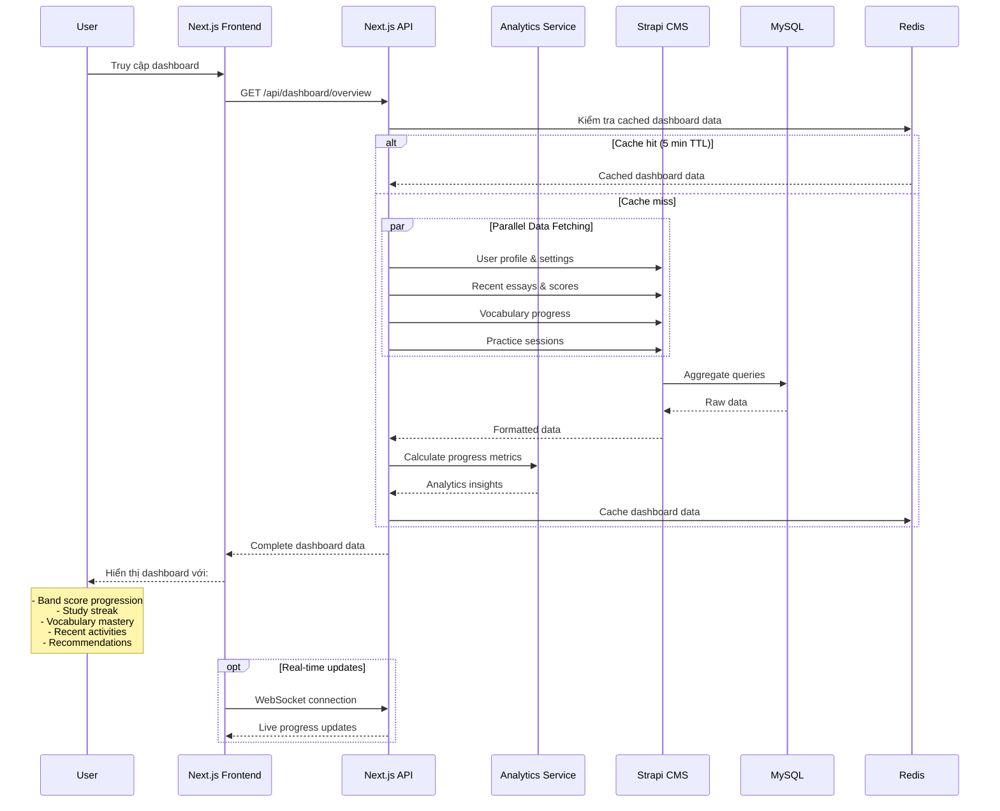

### 5.7. Luồng tối ưu chi phí AI (AI Cost Optimization Flow)

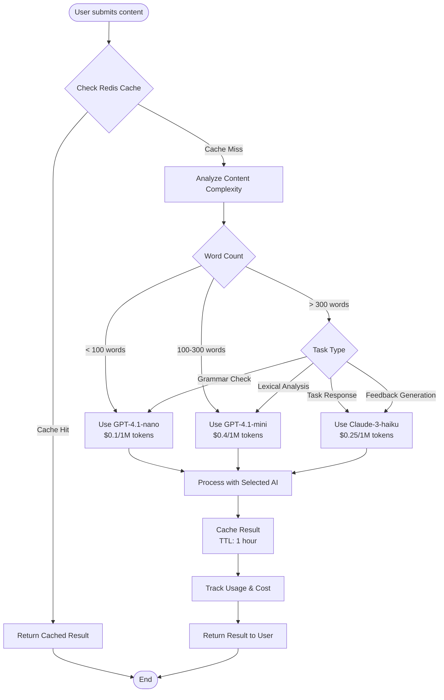

### 5.8. Luồng xử lý lỗi (Error Handling & Fallback Flow)

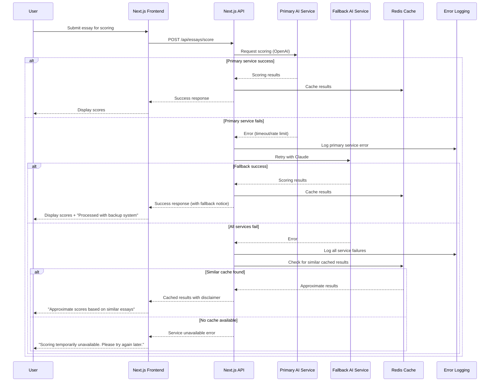

### 5.9. Luồng ứng dụng PWA (Mobile Progressive Web App Flow)

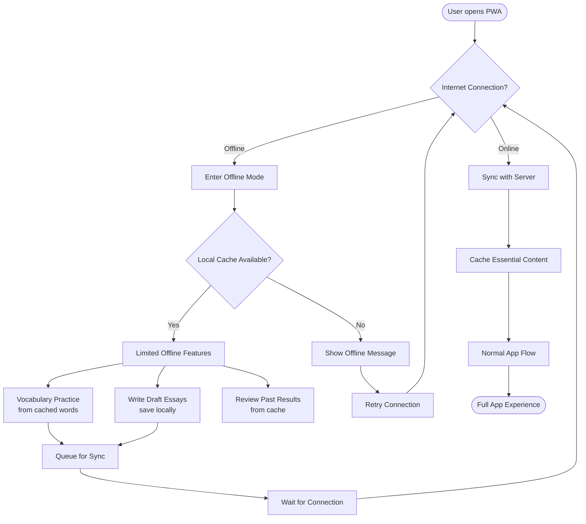

### 5.10. Luồng sao lưu dữ liệu (Data Backup Flow)

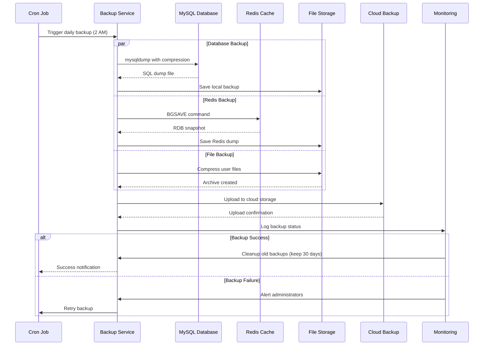

### 5.11. Luồng giám sát hiệu năng (Performance Monitoring Flow)

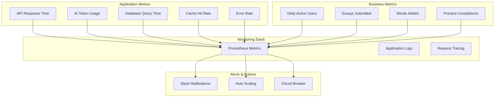

### 5.12. Luồng cộng tác (Tính năng tương lai)

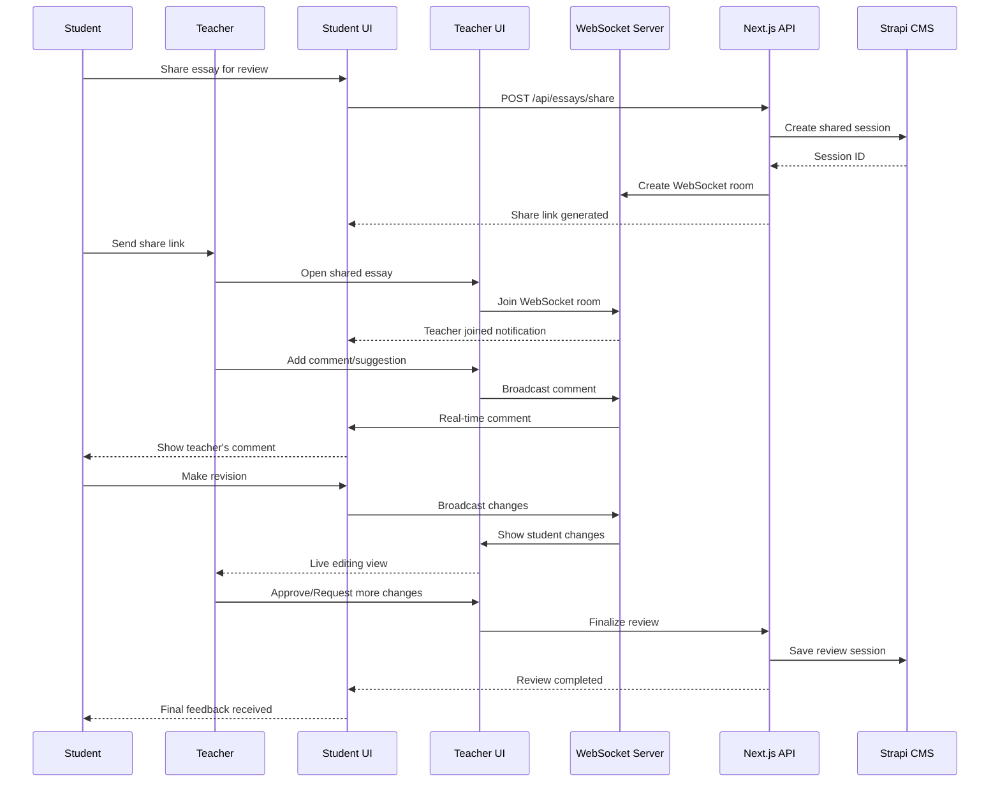

### 5.13. Luồng triển khai CI/CD với Dokploy & GitHub

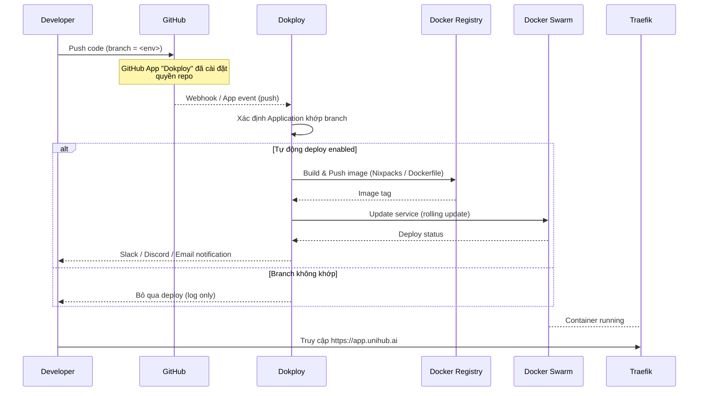

Giải thích chính:

1. **Kết nối GitHub:** Cài GitHub App từ Dokploy, chọn repo và branch cần deploy (docs: *Configure GitHub Integration Steps*).
2. **Tự động Deploy:** Mỗi lần push vào branch đã chọn, Dokploy sẽ tự build (hoặc kéo image) và triển khai; các branch khác không bị ảnh hưởng. Có thể tạo nhiều Application cho `development`, `staging`, `production` (docs: *Understanding Dokploy Automatic Deployments with GitHub*).
3. **Workflow nâng cao:** Nếu muốn build bằng GitHub Actions, dùng action `dokploy/dokploy-action@v1` để gọi `application.deploy` sau khi push image (docs: *GitHub Actions Workflow to Trigger Dokploy Deployment via API*).
4. **Thông báo:** Dokploy hỗ trợ webhook tới Slack/Discord để báo trạng thái.
5. **Traefik:** Vẫn làm reverse-proxy SSL, không đổi.

## 6. Cấu trúc bảng dữ liệu (Database Schema)

Bảng `vocabularies` là trung tâm của tính năng sổ tay từ vựng.

| Tên trường      | Kiểu dữ liệu   | Ý nghĩa/Chức năng                                                                    |
| --------------- | -------------- | ------------------------------------------------------------------------------------ |
| `id`            | `INT`, `PK`, `AI` | Định danh duy nhất cho mỗi từ vựng.                                                   |
| `user_id`       | `INT`, `FK`    | Liên kết với bảng `users`.                                                             |
| `word`          | `VARCHAR(255)` | Từ vựng chính (ví dụ: "environment").                                                  |
| `word_form`     | `VARCHAR(50)`  | Dạng từ (danh từ, động từ, tính từ...).                                               |
| `meaning`       | `TEXT`         | Nghĩa tiếng Việt hoặc giải thích ý nghĩa của từ.                                      |
| `pronunciation` | `VARCHAR(255)` | Phiên âm quốc tế (IPA) hoặc đường dẫn file audio.                                    |
| `examples`      | `JSON`         | Mảng các câu ví dụ.                                                                  |
| `collocations`  | `JSON`         | Mảng các cụm từ đi kèm thường gặp.                                                    |
| `synonyms`      | `JSON`         | Mảng các từ đồng nghĩa.                                                               |
| `antonyms`      | `JSON`         | Mảng các từ trái nghĩa.                                                                |
| `image_url`     | `VARCHAR(255)` | Đường dẫn hình ảnh minh họa (nếu có).                                                  |
| `topic_tags`    | `JSON`         | Các thẻ chủ đề liên quan (ví dụ: `["nature", "pollution"]`).                           |
| `personal_note` | `TEXT`         | Ghi chú cá nhân của người dùng.                                                        |
| `review_date`   | `DATE`         | Ngày ôn tập tiếp theo (phục vụ thuật toán SRS).                                        |
| `ease_factor`   | `FLOAT`        | Độ khó/dễ nhớ của từ (mặc định 2.5, phục vụ SRS).                                      |
| `interval`      | `INT`          | Khoảng cách ngày giữa các lần ôn tập (phục vụ SRS).                                    |
| `created_at`    | `TIMESTAMP`    | Thời gian từ vựng được thêm vào.                                                       |
| `updated_at`    | `TIMESTAMP`    | Thời gian từ vựng được cập nhật gần nhất.                                             |

## 7. Nguồn dữ liệu & API tham khảo

### 7.1. APIs Miễn phí

-   **Free Dictionary API:** (`https://dictionaryapi.dev/`) - Cung cấp định nghĩa, phiên âm, phát âm. Hoàn toàn miễn phí.
-   **Datamuse API:** (`https://www.datamuse.com/api/`) - Tìm collocations, từ liên quan. Miễn phí với giới hạn 100,000 requests/ngày.
-   **Wordnik API:** (`https://developer.wordnik.com/`) - Cung cấp định nghĩa, ví dụ, từ đồng nghĩa. Có gói miễn phí.
-   **Merriam-Webster Dictionary API:** (`https://dictionaryapi.com/`) - Từ điển và từ điển đồng nghĩa/trái nghĩa toàn diện. Yêu cầu đăng ký API key.

### 7.2. Datasets

-   **IELTS Writing Scored Essays:** (`https://www.kaggle.com/datasets/mazlumi/ielts-writing-scored-essays-dataset/data`) - Nguồn tham khảo để huấn luyện hoặc tinh chỉnh các mô hình chấm điểm.
-   **IPA Dictionary Dataset:** (`https://github.com/open-dict-data/ipa-dict`) - Dữ liệu phát âm IPA cho nhiều ngôn ngữ.
-   **Princeton WordNet:** - Dữ liệu về quan hệ ngữ nghĩa giữa các từ (đồng nghĩa, trái nghĩa).

## 8. Chiến lược SEO & Analytics

Để đảm bảo Unihub không chỉ mạnh về tính năng mà còn có khả năng tiếp cận người dùng tự nhiên qua các công cụ tìm kiếm, chúng ta cần một chiến lược SEO và Analytics bài bản.

### 8.1. Technical SEO

Với nền tảng Next.js, Unihub có lợi thế lớn về SEO. Chiến lược sẽ tập trung vào các yếu tố sau:

-   **Server-Side Rendering (SSR) & Static Site Generation (SSG):**
    -   Sử dụng SSG cho các trang có nội dung tĩnh (giới thiệu, blog, câu hỏi thường gặp) để có tốc độ tải trang tức thì và thân thiện với crawler.
    -   Sử dụng SSR cho các trang có nội dung động (dashboard, trang luyện tập) để đảm bảo nội dung mới nhất luôn được Google index.
-   **Metadata & Structured Data:**
    -   **Meta Tags:** Tự động tạo thẻ `<title>` và `<meta name="description">` độc nhất cho mỗi trang (bài luận mẫu, trang chủ đề từ vựng).
    -   **Open Graph & Twitter Cards:** Tích hợp để tối ưu hiển thị khi chia sẻ trên mạng xã hội.
    -   **JSON-LD Structured Data:**
        -   Sử dụng schema `Article` cho các bài viết blog, bài luận mẫu.
        -   Sử dụng schema `WebSite` cho trang chủ.
        -   Có thể định nghĩa schema `EducationalOccupationalProgram` cho toàn bộ nền tảng luyện thi IELTS.
-   **Metadata API (Next.js App Router):**
    -   Áp dụng `export const metadata` hoặc `generateMetadata()` trong `layout.tsx`/`page.tsx` để sinh tự động `<title>`, `<meta name="description">`, `robots`, `canonical`, `alternates` (hreflang) và thẻ xác minh Search Console. Thay thế hoàn toàn cho `next/head`.
-   **Sitemap & Robots.txt:**
    -   Tự động tạo `sitemap.xml` để liệt kê tất cả các trang quan trọng, giúp Google khám phá nội dung hiệu quả.
    -   Cấu hình `robots.txt` để chặn các trang không cần thiết (trang cài đặt cá nhân, trang admin).
    -   Sử dụng thư viện `next-sitemap` (thêm script `"postbuild": "next-sitemap"`) và biến môi trường `NEXT_PUBLIC_SITE_URL` để sinh file sitemap và robots tự động trong quá trình CI/CD.
-   **Internal Linking:**
    -   Xây dựng chiến lược liên kết nội bộ chặt chẽ, ví dụ: từ bài luận mẫu liên kết đến các từ vựng đã dùng trong bài.
-   **SEO Data (Strapi CMS):**
    -   Tạo component `shared.seo` với các trường `metaTitle`, `metaDescription`, `keywords`, `canonicalURL`, `metaRobots`, `metaSocial[]`. Khi truy vấn frontend cần `populate[0]=seo&populate[1]=seo.metaSocial` để đồng bộ dữ liệu SEO.

### 8.2. Google Analytics & Search Console

-   **Google Analytics 4 (GA4):**
    -   Tích hợp GA4 sử dụng `@next/third-parties/google` để theo dõi hành vi người dùng một cách hiệu quả và tối ưu cho Next.js App Router.
    -   Tất cả các sự kiện (events) được định nghĩa ở mục dưới sẽ được gửi lên GA4.
-   **Google Search Console (SC):**
    -   Xác thực website với SC để theo dõi hiệu suất tìm kiếm.
    -   Submit `sitemap.xml` và theo dõi tình trạng index.
    -   Phân tích các từ khóa mà người dùng sử dụng để tìm đến Unihub.

### 8.3. Chiến lược theo dõi sự kiện (Event Tracking)

Để đánh giá hiệu quả sản phẩm và hành vi người dùng, chúng ta sẽ triển khai một hệ thống theo dõi sự kiện chi tiết.

**Quy tắc đặt tên:** `object_verb` (ví dụ: `essay_submitted`).

| Tính năng              | Tên sự kiện (Event Name)              | Thuộc tính (Properties)                                                                 | Mục đích đánh giá                                                                  |
| ----------------------- | ------------------------------------- | --------------------------------------------------------------------------------------- | --------------------------------------------------------------------------------- |
| **User Lifecycle**      | `user_signed_up`                      | `method: "email" \| "google"`                                                           | Đo lường kênh đăng ký hiệu quả.                                                   |
|                         | `user_logged_in`                      | `method: "email" \| "google"`                                                           | Theo dõi tần suất quay lại của người dùng.                                          |
| **Vocabulary**          | `vocabulary_word_added`               | `source: "manual" \| "lookup"`                                                          | Mức độ tương tác với tính năng sổ tay.                                            |
|                         | `vocabulary_word_practiced`           | `word_id`, `is_correct: boolean`                                                        | Hiệu quả của việc học từ vựng.                                                    |
| **Practice**            | `practice_session_started`            | `type: "sentence" \| "paragraph"`, `source: "vocabulary" \| "random"`                   | Tính năng luyện tập nào được ưa chuộng.                                            |
|                         | `practice_hint_used`                  | `practice_id`                                                                           | Mức độ khó của câu hỏi, nhu cầu trợ giúp.                                          |
|                         | `practice_submission_completed`       | `practice_id`, `score: number`                                                          | Tỷ lệ hoàn thành và điểm số trung bình.                                            |
| **Essay**               | `essay_submitted`                     | `essay_id`, `word_count: number`, `time_taken_seconds: number`                          | Tần suất nộp bài, thời gian hoàn thành.                                            |
|                         | `essay_score_viewed`                  | `essay_id`, `overall_band: number`                                                      | Người dùng có quan tâm đến kết quả chấm điểm không?                               |
|                         | `essay_feedback_compared`             | `essay_id`                                                                              | Mức độ tương tác với feedback của AI.                                              |
| **Gamification**        | `daily_quest_completed`               | `quest_name`                                                                            | Mức độ hiệu quả của hệ thống nhiệm vụ.                                             |
|                         | `streak_achieved`                     | `streak_days: number`                                                                   | Khả năng giữ chân người dùng.                                                     |
| **PWA**                 | `pwa_installed`                       |                                                                                         | Tỷ lệ người dùng cài đặt PWA.                                                     |
|                         | `app_used_offline`                    |                                                                                         | Mức độ sử dụng app khi không có mạng.                                             |

### 8.4. Checklist triển khai (Dev & Ops)

- **Biến môi trường mẫu (.env):**
    ```env
    NEXT_PUBLIC_SITE_URL=https://unihub.ai
    NEXT_PUBLIC_GA_ID=G-XXXXXXXXXX
    STRAPI_API_URL=https://cms.unihub.ai
    STRAPI_TOKEN=YOUR_STRAPI_TOKEN
    ```

- **Thiết lập sitemap:**
    1. `npm i next-sitemap -D`
    2. Tạo `next-sitemap.config.mjs`:
        ```js
        export default {
          siteUrl: process.env.NEXT_PUBLIC_SITE_URL,
          generateRobotsTxt: true,
        };
        ```
    3. Thêm script build: `"postbuild": "next-sitemap"`.

- **Tích hợp GA4:**
    - Thêm `<GoogleAnalytics gaId={process.env.NEXT_PUBLIC_GA_ID} />` trong `app/providers.tsx`, chỉ render khi `process.env.NODE_ENV === "production"`.
    - Sử dụng hằng `EVENTS` (định nghĩa ở trên) để gọi `gtag('event', EVENTS.xxx)` trong client components.

- **Ánh xạ dữ liệu SEO từ Strapi → Metadata API:**
    ```ts
    export const mapSeo = (seo) => ({
      title: seo.metaTitle,
      description: seo.metaDescription,
      alternates: { canonical: seo.canonicalURL },
      openGraph: {
        title: seo.metaTitle,
        description: seo.metaDescription,
        images: seo.metaSocial?.map((s) => ({ url: s.image?.url, alt: s.title })),
      },
    });
    ```

- **Hiệu năng & Core Web Vitals mục tiêu:**
    - LCP < 2.5s (mobile), CLS < 0.1, FID/FCP đạt mức "Good" theo Lighthouse.
    - Kiểm tra định kỳ bằng Vercel Analytics hoặc Google PageSpeed.

- **Kiểm thử SEO:**
    - Rich Results Test cho bài blog.
    - ScreamingFrog/Ahrefs để kiểm tra canonical/hreflang/404.